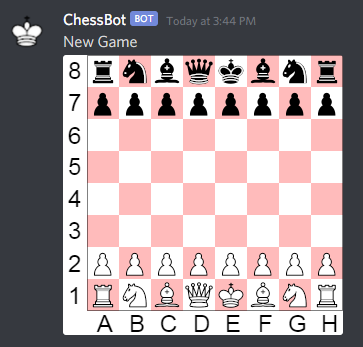

# discord-chess-bot

A simple chess bot for discord that allows people to play chess with a visual board.

## Instructions

* Clone this repo.
* Create a discord application (and make it a bot) through here: https://discord.com/developers/applications
* Invite the new bot to your server with: https://discordapp.com/oauth2/authorize?&client_id=CLIENT_ID&scope=bot&permissions=0 where `CLIENT_ID` is your application's CLIENT_ID.
* Get your bot's token.
* Create a `.env` file and put `DISCORD_BOT_TOKEN=<your-token-here>` inside it.
* Put `BOT_CHANNEL=my-channel` in the `.env` file where `my-channel` is the discord channel the bot will interact with users.
* `npm install`
* `node index.js`
